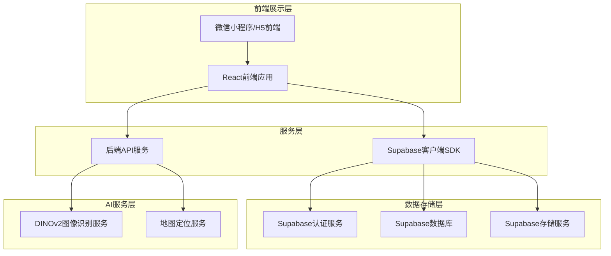
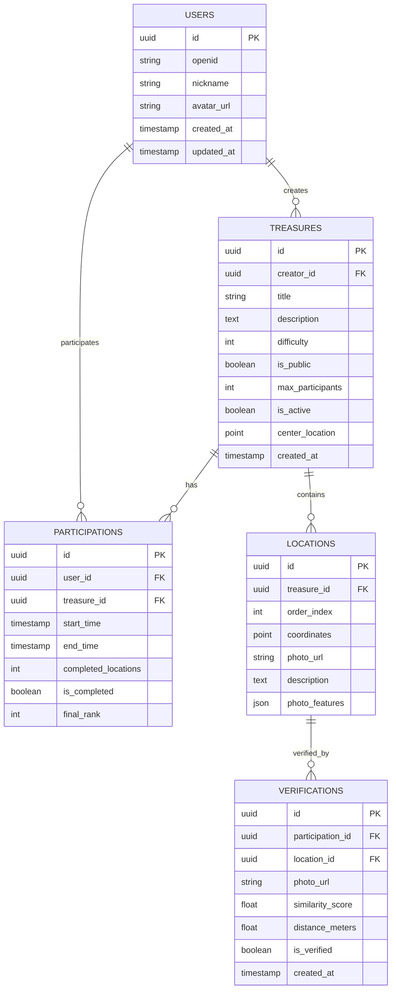
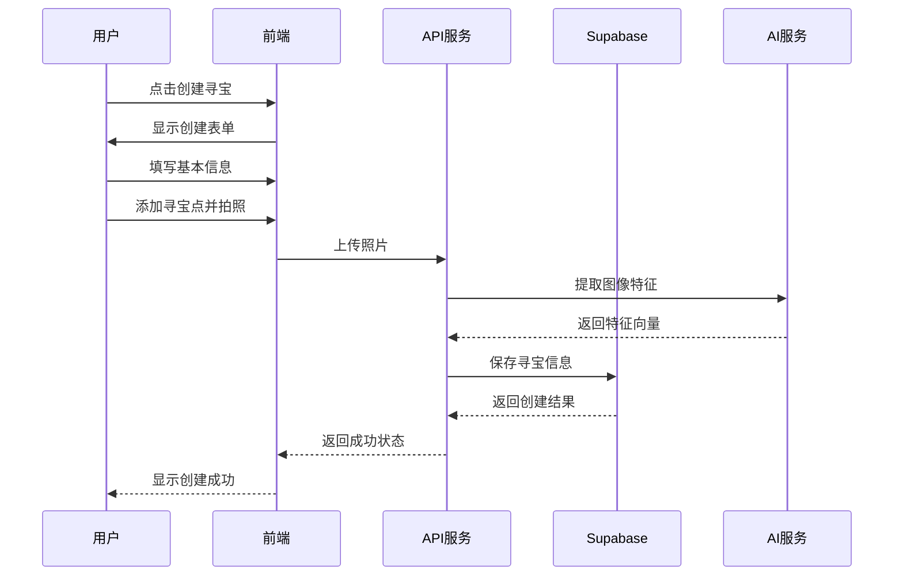
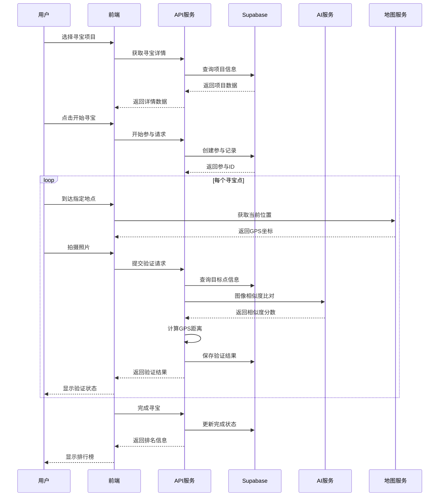

# 寻宝应用设计文档

## 项目概述

寻宝应用是一个基于地理位置的社交游戏平台，用户可以在现实世界中创建和参与寻宝游戏。通过微信小程序和H5页面，用户可以拍照创建寻宝点，其他玩家通过GPS定位和图像识别技术找到这些地点，完成寻宝挑战。

### 核心特色
- **AR寻宝体验**：结合现实地理位置的沉浸式寻宝游戏
- **图像AI识别**：使用DINOv2模型进行图像相似度比对，确保寻宝真实性
- **社交互动**：用户可以创建寻宝项目，邀请朋友参与挑战
- **精准定位**：GPS定位精度达到10米，确保寻宝体验的准确性

---n
## 产品需求

### 用户角色
| 角色 | 注册方式 | 核心权限 |
|------|----------|----------|
| 普通用户 | 微信小程序授权登录 | 创建寻宝、参与寻宝、查看排行榜 |
| 管理员 | 后台分配 | 管理寻宝项目、处理举报内容 |

### 功能模块

#### 1. 寻宝创建流程
- **项目设置**：标题、描述、难度等级（1-5星）
- **地点规划**：在地图上选择多个寻宝点，每个点拍照并添加描述
- **规则设定**：设置寻宝是否公开、参与人数限制
- **发布确认**：一键发布寻宝项目，系统自动生成寻宝路线

#### 2. 寻宝参与流程
- **项目浏览**：按距离、难度、热度筛选寻宝项目
- **游戏开始**：点击"开始寻宝"，系统开始计时
- **导航指引**：集成地图导航，显示最近寻宝点路线
- **验证机制**：
  - GPS定位验证：必须在目标点10米范围内
  - 图像识别验证：使用DINOv2模型，相似度≥60%视为通过
- **进度追踪**：实时显示已完成寻宝点数量和总用时
- **成绩记录**：以第一次完成寻宝的时间作为最终排名依据

#### 3. 社交功能
- **排行榜系统**：显示所有参与者的完成时间和排名
- **个人中心**：管理创建的寻宝、查看参与历史
- **分享功能**：支持将寻宝项目分享到微信好友和朋友圈

---

## 技术架构

### 系统架构图



### 技术栈选择

- **前端框架**: React@18 + Taro@3（微信小程序适配）+ Vite
- **后端服务**: Node.js@18 + Express@4
- **数据库**: Supabase（PostgreSQL）
- **文件存储**: Supabase Storage
- **地图服务**: 腾讯地图API
- **图像识别**: DINOv2模型部署在服务器端
- **认证服务**: Supabase Auth（支持微信登录）

### 核心页面路由

| 路由 | 页面名称 | 核心功能 |
|-------|---------|----------|
| / | 首页 | 寻宝列表展示，支持筛选和搜索 |
| /create | 创建寻宝页 | 创建新的寻宝项目 |
| /treasure/:id | 寻宝详情页 | 显示寻宝项目详情和参与入口 |
| /game/:id | 游戏进行页 | 寻宝游戏主界面，包含地图和拍照 |
| /ranking/:id | 排行榜页 | 显示寻宝项目的完成排名 |
| /profile | 个人中心页 | 用户个人信息和历史记录 |

---

## API接口设计

### 认证相关API

#### 微信小程序登录
```
POST /api/auth/wechat-login
```

**请求参数**:
```json
{
  "code": "微信登录code",
  "userInfo": {
    "nickName": "用户昵称",
    "avatarUrl": "头像URL"
  }
}
```

**响应参数**:
```json
{
  "token": "JWT访问令牌",
  "user": {
    "id": "用户ID",
    "nickname": "用户昵称",
    "avatarUrl": "头像URL"
  },
  "expiresIn": 86400
}
```

### 寻宝项目API

#### 创建寻宝项目
```
POST /api/treasures
```

**请求参数**:
```json
{
  "title": "城市公园寻宝",
  "description": "在市中心公园寻找5个隐藏的宝藏点",
  "difficulty": 3,
  "isPublic": true,
  "maxParticipants": 50,
  "locations": [
    {
      "lat": 31.2304,
      "lng": 121.4737,
      "photo": "base64编码的图片",
      "description": "公园入口处的雕像"
    }
  ]
}
```

#### 获取寻宝列表
```
GET /api/treasures?lat=31.2304&lng=121.4737&radius=5000
```

### 游戏验证API

#### 验证寻宝点
```
POST /api/game/verify-location
```

**请求参数**:
```json
{
  "treasureId": "寻宝项目ID",
  "locationId": "寻宝点ID",
  "userLat": 31.2304,
  "userLng": 121.4737,
  "photo": "base64编码的照片"
}
```

**响应参数**:
```json
{
  "verified": true,
  "similarity": 75.5,
  "distance": 8.2,
  "nextLocation": {
    "id": "下一个寻宝点ID",
    "lat": 31.2305,
    "lng": 121.4738,
    "description": "湖心亭"
  }
}
```

---

## 数据库设计

### 数据模型关系图



### 核心表结构

#### 用户表（users）
```sql
CREATE TABLE users (
    id UUID PRIMARY KEY DEFAULT gen_random_uuid(),
    openid VARCHAR(100) UNIQUE NOT NULL,
    nickname VARCHAR(100),
    avatar_url TEXT,
    created_at TIMESTAMP WITH TIME ZONE DEFAULT NOW(),
    updated_at TIMESTAMP WITH TIME ZONE DEFAULT NOW()
);
```

#### 寻宝项目表（treasures）
```sql
CREATE TABLE treasures (
    id UUID PRIMARY KEY DEFAULT gen_random_uuid(),
    creator_id UUID REFERENCES users(id),
    title VARCHAR(200) NOT NULL,
    description TEXT,
    difficulty INTEGER CHECK (difficulty >= 1 AND difficulty <= 5),
    is_public BOOLEAN DEFAULT true,
    max_participants INTEGER DEFAULT 100,
    is_active BOOLEAN DEFAULT true,
    center_location GEOGRAPHY(POINT, 4326),
    created_at TIMESTAMP WITH TIME ZONE DEFAULT NOW()
);
```

#### 寻宝地点表（locations）
```sql
CREATE TABLE locations (
    id UUID PRIMARY KEY DEFAULT gen_random_uuid(),
    treasure_id UUID REFERENCES treasures(id) ON DELETE CASCADE,
    order_index INTEGER NOT NULL,
    coordinates GEOGRAPHY(POINT, 4326) NOT NULL,
    photo_url TEXT NOT NULL,
    description TEXT,
    photo_features JSONB,
    UNIQUE(treasure_id, order_index)
);
```

---

## 用户流程设计

### 创建寻宝流程



### 参与寻宝流程



---

## 关键技术实现

### 1. GPS定位验证
- **精度要求**: 10米范围内验证通过
- **实现方式**: 使用腾讯地图API计算两点间距离
- **容错处理**: 考虑GPS信号误差，允许10米误差范围

### 2. 图像相似度识别
- **AI模型**: DINOv2（自监督视觉Transformer模型）
- **相似度阈值**: ≥60%视为验证通过
- **特征提取**: 提取图像的深层特征向量进行比对
- **性能优化**: 使用向量数据库存储和检索特征

### 3. 微信小程序集成
- **登录授权**: 使用wx.login获取code，后端换取session_key
- **地图组件**: 使用微信小程序原生map组件
- **拍照功能**: 使用wx.chooseImage和wx.getImageInfo
- **分享功能**: 使用wx.shareAppMessage实现社交分享

### 4. 数据安全与隐私
- **位置隐私**: 寻宝点位置数据加密存储
- **图片处理**: 用户上传照片进行内容安全检测
- **权限控制**: 基于Supabase RLS实现细粒度权限控制
- **数据备份**: 定期备份重要数据，确保数据安全

---

## 部署与运维

### 开发环境搭建
```bash
# 前端项目初始化
npm create vite@latest treasure-hunt-frontend --template react-ts
npm install @tarojs/taro @tarojs/components
npm install @supabase/supabase-js

# 后端项目初始化
npm init -y
npm install express cors helmet morgan
npm install @supabase/supabase-js
npm install @tensorflow/tfjs-node  # DINOv2模型运行环境
```

### 环境变量配置
```env
# 前端环境变量
VITE_SUPABASE_URL=your_supabase_url
VITE_SUPABASE_ANON_KEY=your_supabase_anon_key
VITE_API_BASE_URL=http://localhost:3000/api

# 后端环境变量
SUPABASE_URL=your_supabase_url
SUPABASE_SERVICE_KEY=your_supabase_service_key
WECHAT_APP_ID=your_wechat_app_id
WECHAT_APP_SECRET=your_wechat_app_secret
TENCENT_MAP_KEY=your_tencent_map_key
```

### 部署架构
- **前端**: 微信小程序直接发布，H5页面部署到CDN
- **后端**: 使用Vercel或阿里云函数计算部署API服务
- **数据库**: Supabase托管PostgreSQL数据库
- **文件存储**: Supabase Storage存储用户上传的图片
- **监控**: 使用Sentry进行错误监控和性能分析

---

## 后续优化方向

### 1. 功能增强
- **AR增强现实**: 集成AR功能，提供更沉浸式的寻宝体验
- **语音导航**: 添加语音播报功能，提升用户体验
- **团队合作**: 支持多人组队寻宝模式
- **积分系统**: 建立积分商城，增加用户粘性

### 2. 技术优化
- **边缘计算**: 使用CDN边缘节点部署AI模型，降低延迟
- **缓存优化**: 使用Redis缓存热点数据，提升响应速度
- **数据库优化**: 建立合适的索引，优化查询性能
- **图片压缩**: 使用WebP格式压缩图片，节省存储和带宽

### 3. 商业变现
- **会员服务**: 提供高级会员功能，如创建更多寻宝项目
- **广告植入**: 在寻宝项目中植入品牌合作内容
- **线下活动**: 组织线下寻宝活动，收取参与费用
- **数据服务**: 为商家提供用户行为分析数据服务